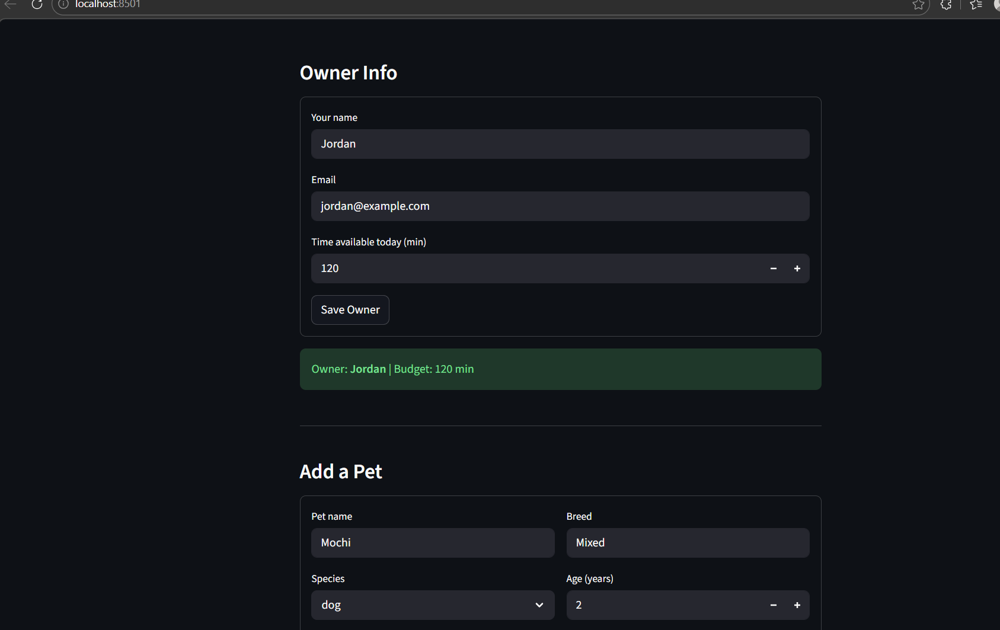

# PawPal+

**PawPal+** is a Streamlit app that helps a pet owner build and manage a daily care schedule for one or more pets. The owner enters their available time, adds pets, defines tasks with priorities and recurrence rules, and the app produces a time-slotted plan — complete with conflict warnings and scheduling reasoning.

---

## Features

### Owner & Pet Management
- **Owner profile** — store your name, email, and daily time budget (in minutes).
- **Multi-pet support** — add any number of pets, each with their own name, species, breed, age, and weight.
- **Per-pet task lists** — tasks belong to a specific pet and carry a back-reference so they are always traceable.

### Task Configuration
- **Task categories** — classify each task as Walk, Feeding, Medication, Enrichment, Grooming, or Other.
- **Priority levels** — assign a priority from 1 (low) to 5 (critical) to control scheduling order.
- **Time-of-day preference** — tag each task as Morning, Afternoon, Evening, or Any to influence when it is placed in the day.
- **Task editing** — update or replace any existing task by ID without recreating it from scratch.

### Scheduling Algorithms
- **Priority-based greedy scheduling** — the scheduler ranks tasks by priority (highest first), then by time-of-day band, and greedily fills the owner's time budget. The most critical tasks are always guaranteed a slot before lower-priority ones are considered.
- **Time-of-day band assignment** — tasks are grouped into Morning (from 07:00), Afternoon (from 12:00), Evening (from 18:00), and Any (from 09:00) bands. Within each band, tasks are placed back-to-back with no gaps, producing a fully time-slotted plan.
- **Sorting by start time** — the final plan is always displayed in chronological order regardless of the order tasks were added.

### Recurrence
- **Daily recurrence** — a task marked complete automatically generates a new instance due the following day.
- **Weekdays recurrence** — the next occurrence skips the weekend; completing on Friday produces a Monday due date.
- **Weekly recurrence** — the next occurrence is due exactly 7 days later.
- **One-off tasks** — tasks with no recurrence rule are removed from future plans once completed.

### Conflict Detection
- **Same-pet conflict warnings** — if two tasks for the same pet overlap in their assigned time window, the scheduler surfaces a plain-language warning message instead of crashing.
- **Cross-pet conflict warnings** — if tasks belonging to different pets overlap, the owner is flagged as double-booked. This catches cases like a dog walk and a cat vet visit both starting at 07:00.
- **Back-to-back safety** — tasks that share only an endpoint (one ends exactly when the next begins) are correctly treated as non-conflicting.

### Plan Filtering & Display
- **Filter by category** — view only walks, only feedings, or any other category in isolation.
- **Filter incomplete tasks** — see only what still needs to be done today.
- **Budget metrics** — the UI shows scheduled minutes, total budget, and remaining time at a glance.
- **Scheduling reasoning** — every generated plan includes a plain-text explanation of which tasks were chosen, in what priority order, and how much of the budget they consume.

---

## Scenario

A busy pet owner needs help staying consistent with pet care. They want an assistant that can:

- Track pet care tasks (walks, feeding, meds, enrichment, grooming, etc.)
- Consider constraints (time available, priority, owner preferences)
- Produce a daily plan and explain why it chose that plan

## Smarter Scheduling

The scheduler (`Scheduler` in `pawpal_system.py`) goes beyond a simple task list with the following features:

- **Recurring tasks** — tasks carry a `RecurrenceRule` (`DAILY`, `WEEKDAYS`, `WEEKLY`). When a recurring task is marked complete via `Pet.complete_task()`, a new instance is automatically created with the next due date (today + 1 day for daily, next weekday for weekdays, today + 7 days for weekly).

- **Time-of-day bands** — tasks declare a preferred time (`MORNING`, `AFTERNOON`, `EVENING`, `ANY`). The scheduler groups tasks into these bands and assigns consecutive start/end times within each band so the output is a fully time-slotted plan.

- **Priority-based budget fitting** — tasks are sorted by priority (highest first) and added greedily until the owner's available time is exhausted. This guarantees the most critical tasks always make it into the plan.

- **Filtering** — `DailyPlan` exposes `get_walks()`, `get_by_category()`, and `get_incomplete()` to slice the plan by task type or completion status.

- **Conflict detection** — the scheduler detects two kinds of scheduling conflicts and surfaces them as warning messages (no crashes):
  - *Same-pet*: two tasks for one pet overlap in the assigned time window.
  - *Cross-pet*: tasks belonging to different pets overlap, meaning the owner would be double-booked.

## Testing PawPal+

### Run the test suite

```bash
python -m pytest
```

To see each test name as it runs:

```bash
python -m pytest -v
```

### What the tests cover

The suite contains **32 tests** across five classes in `tests/test_pawpal.py`:

| Class | Tests | What is verified |
|---|---|---|
| `TestMarkComplete` | 3 | Task defaults to incomplete; `mark_complete()` sets the flag; calling it twice is safe |
| `TestAddTask` | 4 | New pet has no tasks; each `add_task()` grows the list; the stored object is the same reference |
| `TestRecurrenceLogic` | 9 | Daily → tomorrow; weekly → 7 days; weekdays on Friday → Monday; `NONE` returns `None`; `Pet.complete_task()` auto-appends next occurrence; unknown task id is safe |
| `TestSortingCorrectness` | 4 | `display_summary()` is chronological; higher priority ranks first; equal-priority tiebreaks by time-of-day band; same-band tasks are scheduled back-to-back |
| `TestConflictDetection` | 8 | Back-to-back tasks don't conflict (boundary check); overlapping and fully-contained tasks are flagged; cross-pet overlaps produce a warning; non-overlapping cross-pet tasks are clean |
| `TestBudgetFitting` | 4 | Task exactly at budget is included; one minute over is excluded; empty list is safe; greedy stops after budget is exhausted |

### Confidence level

**4 / 5 stars**

The core scheduling pipeline — prioritization, budget fitting, time assignment, and conflict detection — is fully covered, including the most common boundary conditions (exact budget fit, adjacent task endpoints, Friday weekday recurrence). Confidence is high for single-day scheduling with a small number of tasks per pet, which is the primary use case.

The one star withheld reflects gaps in the current suite:
- No tests for the Streamlit UI layer (`app.py`)
- No tests for tasks long enough to push the scheduler cursor past midnight
- No integration test that runs `generate_all_plans()` end-to-end and inspects the full output

## DEMO
<a href="pawpal.png" target="_blank"></a>

## Getting started

### Setup

```bash
python -m venv .venv
source .venv/bin/activate  # Windows: .venv\Scripts\activate
pip install -r requirements.txt
```

### Suggested workflow

1. Read the scenario carefully and identify requirements and edge cases.
2. Draft a UML diagram (classes, attributes, methods, relationships).
3. Convert UML into Python class stubs (no logic yet).
4. Implement scheduling logic in small increments.
5. Add tests to verify key behaviors.
6. Connect your logic to the Streamlit UI in `app.py`.
7. Refine UML so it matches what you actually built.
